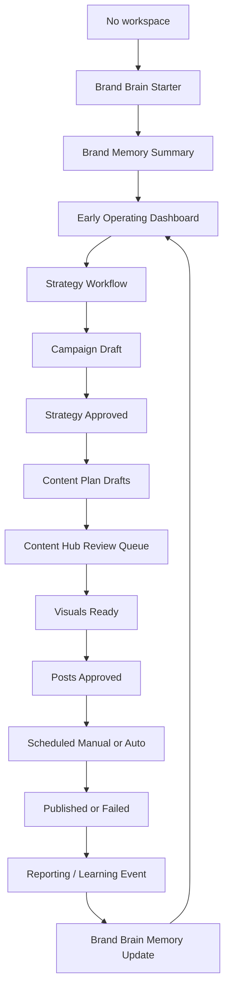

# JM-D1 — NEXUS Master User Journey & Operating Model Study

Date: 2026-06-21  
Scope: product journey, operating model, trust gates, and implementation roadmap  
Repository: `/Users/raoufnaguib/Desktop/Nexus-ai`  
Mode: read-only product/UX/engineering study; no code changes

## 1. Executive Verdict

NEXUS is no longer just an AI generator. The codebase already contains several serious foundations of an AI marketing operating system:

- Brand Brain memory and readiness concepts.
- Early Operating Mode on the dashboard.
- Strategy page that does not falsely generate, publish, or spend.
- Content Hub with draft, approval, scheduling, visual generation, manual publishing, and Brand Brain learning events.
- Manual publishing path that records user confirmation without calling social APIs.
- Auto-publishing safety gate that only publishes `SCHEDULED` posts with `publishMode === 'AUTO'`.
- Credit checks, visible image cost, daily image caps, and refund-safety work across AI routes.
- Paid campaign pack planning that is not yet an ad-launcher.

The biggest current gap is not lack of features. The gap is operating continuity.

The product has many strong modules, but the user journey still needs one clear operating spine that tells the user:

1. What NEXUS knows.
2. What is missing.
3. What decision is required now.
4. What will happen after approval.
5. What will not happen yet.

The target should be:

> Brand Brain → Strategy Workflow → Campaign Decision → Content Plan → Content Hub Review → Creative Studio Lite → Calendar → Manual/Auto Publishing → Reporting → Learning Loop → Next Recommendation.

Until this spine is explicit, users and partners may feel the system is powerful but slightly confusing: strong parts, weak orchestration.

## 2. Current Product Truth Rules

These rules should become product law across every page:

1. NEXUS must not claim a full strategy exists until one was actually generated and saved.
2. NEXUS must not claim publishing is active until posts are scheduled or published.
3. NEXUS must not claim performance insights until real data exists.
4. NEXUS must not imply paid ads are launched unless a human explicitly approves budget, platform, copy, and external launch.
5. NEXUS must not auto-publish manual or legacy posts.
6. NEXUS must not spend credits without a pre-action expectation and a refund path.
7. NEXUS must not treat draft/test campaigns as proof of real marketing execution.
8. NEXUS must separate:
   - setup progress,
   - strategy readiness,
   - publishing readiness,
   - performance results,
   - learned memory.

The code already supports many of these rules. The UI and journey should keep making them obvious.

## 3. User Types / Starting States

| User state | Evidence | Product interpretation | Correct first experience |
|---|---|---|---|
| New logged-in user, no workspace | no workspace row | cannot operate yet | route to onboarding, collect minimum Brand Brain starter |
| Workspace exists, Brand Brain empty | workspace exists, missing profile | setup not complete | Brand Brain starter or Brand page completion |
| Brand Brain started, no execution | brand exists, 0 published, 0 scheduled, no active campaign | Early Operating Mode | one next action: open strategy workflow |
| Draft campaigns only | campaign records exist, no real execution | still early | do not show full cockpit as if marketing is live |
| Content plan created, not approved | SocialPost DRAFT/PENDING | review stage | Content Hub should become the operating queue |
| Content approved, not scheduled | SocialPost APPROVED | scheduling decision needed | schedule/manual/connection gate |
| Scheduled manual posts | SCHEDULED + MANUAL | user action required outside NEXUS | manual publish checklist |
| Scheduled auto posts | SCHEDULED + AUTO | system may publish later | clear auto-publish status and platform connection proof |
| Published posts exist | PUBLISHED | real execution exists | normal dashboard and reporting can appear |
| Paid plan generated | PaidCampaignPack exists | planning exists, not launch | paid review/approval/budget gate |

## 4. Master Journey Map

### Stage 0 — Login / Workspace Gate

| Dimension | Recommendation |
|---|---|
| User goal | Get into the product without confusion. |
| NEXUS goal | Confirm whether the user has a workspace before rendering a cockpit. |
| Required data | Auth user, workspace existence. |
| Current surface | `/dashboard`, `WorkspaceGateState`; `/onboarding`. |
| Primary CTA | Continue setup if no workspace; otherwise show dashboard. |
| State created | Workspace row after onboarding starts/saves. |
| Failure state | Retry state, not fake onboarding redirect on fetch error. |
| Must not show | Full dashboard cockpit before workspace check completes. |

Assessment: D0.3 direction is correct. Workspace gate protects trust.

### Stage 1 — First Intent Selection

This is not yet clearly formalized as a product step.

| Dimension | Recommendation |
|---|---|
| User goal | Tell NEXUS why they came: get content, grow leads, fix marketing, plan paid ads, understand brand. |
| NEXUS goal | Route the first journey without asking too much too soon. |
| Required data | Business type, goal, urgency, preferred language. |
| Current surface | Onboarding collects goal/language, but no explicit intent selection. |
| Primary CTA | "Start with my marketing strategy" / "Create my first content plan". |
| State created | `firstIntent` in preferences or Brand Brain metadata later. |
| Trust copy | "This helps NEXUS choose the next step. It will not publish or spend." |
| Must not show | Analytics, performance claims, paid launch promises. |

Recommended: add a small first-intent decision in a later onboarding continuity PR.

### Stage 2 — Brand Brain Starter

| Dimension | Current reality / recommendation |
|---|---|
| User goal | Quickly define the business. |
| NEXUS goal | Capture minimum durable brand memory. |
| Current surface | `/onboarding/page.tsx`. |
| Required data | businessName, industry, region, customerLanguage, offer, goal, idealCustomer, whyChoose, marketingStatus, platforms. |
| Primary CTA | Start business setup → save Brand Brain → dashboard. |
| State created | workspace via `/api/workspaces`; brand via `/api/brand`. |
| Good current rule | Onboarding explicitly does not generate a strategy, publish, or claim readiness. |
| Failure state | Safe error; user can retry. |
| Must not show | "Marketing system complete", "strategy ready", "analytics active". |

Assessment: strong. This is one of the healthiest parts of the product.

### Stage 3 — Initial Brand Memory Summary

| Dimension | Recommendation |
|---|---|
| User goal | Understand what NEXUS learned. |
| NEXUS goal | Build trust through transparent memory. |
| Current surface | Onboarding summary. |
| Primary CTA | View next step / view Brand Brain. |
| State created | no new production action; this is a confirmation surface. |
| Should show | What NEXUS knows, what still needs clarification, honest readiness. |
| Must not show | Any performance, publishing, or paid readiness not backed by data. |

Assessment: strong. This should become the standard pattern for all later learning moments.

### Stage 4 — Early Dashboard Operating Mode

| Dimension | Recommendation |
|---|---|
| User goal | Know what to do next. |
| NEXUS goal | Avoid cockpit overload before real execution exists. |
| Current surface | `/dashboard/page.tsx`, `isEarlyOperatingMode`. |
| Current detection | no published content, no scheduled/live publishing state, no ACTIVE campaign. |
| Primary CTA | Open strategy workflow. |
| Secondary CTA | save/add recommendation only if the wording is non-technical. |
| Should show | credits, next best action, platform readiness below action, recent campaigns lower. |
| Should hide | large zero stats, AI Insights "everything looks great", Alerts/Sentinel as if live monitoring is active. |
| Must not show | fake analytics, fake publishing, fake paid readiness. |

Assessment: D1.1 is the right direction. This is essential because draft campaigns are not real execution.

### Stage 5 — Strategy Workflow

| Dimension | Current reality / recommendation |
|---|---|
| User goal | Turn Brand Brain into an actionable marketing plan. |
| NEXUS goal | Move from data capture to operating decision. |
| Current surface | `/strategy/page.tsx`; `/api/strategy/run-full`. |
| Important current rule | Strategy page itself is read-only: no generation, no credits, no publishing, no ads. |
| Primary CTA | Generate or open strategy workflow from dashboard. |
| Server gate | `/api/strategy/run-full` recomputes charge server-side and checks Brand Brain readiness. |
| State created | Campaign and AI output if generation succeeds. |
| Failure state | no workspace, no Brand Profile, incomplete Brand Brain, unsupported duration, rate limit, provider failure. |
| Must not show | budgets/KPIs/results as facts unless generated as planning assumptions and labeled that way. |

Assessment: the separation between strategy overview and actual run-full generation is healthy. The next UX task is to make the strategy workflow feel like a guided approval flow rather than "press a magic button".

### Stage 6 — Campaign Decision / Approval

| Dimension | Recommendation |
|---|---|
| User goal | Decide whether the generated plan is usable. |
| NEXUS goal | Convert generated strategy into an approved operating object. |
| Current surface | campaign detail and Content Hub entry points. |
| Required data | campaign id, strategy output, platforms, objective, language, media selection. |
| Primary CTA | Approve strategy and build content plan. |
| Secondary CTA | revise strategy / regenerate with changed inputs. |
| State created | campaign status should clearly move from DRAFT to APPROVED or READY_FOR_CONTENT. |
| Must not show | "active campaign" while it is only draft. |

Gap: campaign status semantics need a unified lifecycle. Today dashboard can see draft campaigns, but the user needs clearer "Draft — needs review before execution" labeling.

### Stage 7 — Content Plan Generation

| Dimension | Current reality / recommendation |
|---|---|
| User goal | Get a monthly set of posts from the strategy. |
| NEXUS goal | Create reviewable post drafts with captions, prompts, media assignments, and dates. |
| Current route | `/api/campaigns/[id]/generate-content-plan`. |
| Credit touchpoint | `CONTENT_PLAN_GENERATION` = 2 credits. |
| Current strengths | uses campaign strategy, platform quota, uploaded media, language instruction, selected media IDs, vision analysis for selected assets, and post creation. |
| State created | SocialPost rows with `DRAFT`, `PENDING`, `DONE`, `AWAITING_UPLOAD`, scheduledAt. |
| Failure state | refund path exists for no usable content after retries. |
| Must not show | generated plan as published or live. |

Important observation: the route already analyzes selected uploaded images/videos and can generate image-matched captions. Product copy should make this visible only where true: "Selected images are analyzed to help captions match the visual."

### Stage 8 — Content Hub Operating Queue

| Dimension | Current reality / recommendation |
|---|---|
| User goal | Review, edit, approve, generate images, and move content toward schedule. |
| NEXUS goal | Become the operational command center for campaign content. |
| Current surface | `/campaigns/[id]/content-hub/page.tsx`. |
| Current states | DRAFT, APPROVED, SCHEDULED, PUBLISHED, FAILED; generation PENDING, GENERATING, DONE, FAILED, AWAITING_UPLOAD, SKIPPED. |
| Primary CTA sequence | Generate plan → review drafts → generate missing images → approve → schedule → publish/manual confirm. |
| Current strengths | per-post preview, media source, image generation, A/B variants, approval modal, manual publish checklist, learning events. |
| Weakness | visually and conceptually this can feel like a gallery instead of an operating queue. |
| Must not show | "content plan is live" before scheduling/publishing is actually true. |

Recommended operating model:

1. Queue header: "18 drafts awaiting review".
2. Tabs by state: Drafts, Needs visuals, Approved, Scheduled, Published, Failed.
3. Each post card should have one next action.
4. Summary should show: Drafts, Approved, Scheduled manual, Scheduled auto, Published, Failed.
5. Visual generation should always show cost and refund statement.
6. Approval should never imply publishing.

### Stage 9 — Creative Studio Lite

NEXUS does not need to become Canva. It needs a lightweight ad-ready creative workflow.

| Dimension | Recommendation |
|---|---|
| User goal | Make a generated/uploaded creative usable for a campaign. |
| NEXUS goal | Help create branded, platform-ready assets without a full design suite. |
| Current surface | image generation, media library, brand composite system, post previews. |
| Primary actions | generate image, use uploaded image, crop/fit, apply brand frame/text overlay, export/use in post. |
| Should include | platform aspect selector, brand colors, logo placement, text-safe preview, regenerate background, replace media. |
| Should avoid | complex layers, freeform canvas, pretending to be a full editor. |
| State created | post imageUrl, media association, creative version metadata later. |

This should be a later PR after the content operating queue is calmer.

### Stage 10 — Uploaded Video Composer

| Dimension | Recommendation |
|---|---|
| User goal | Use existing video clips in posts without expensive AI video. |
| NEXUS goal | Keep costs low while supporting video-first platforms. |
| Current basis | Content plan distinguishes video slots; uploaded media can include VIDEO; TikTok requires video URL. |
| Primary action | Upload/select video → generate caption/script → add thumbnail/frame/CTA overlay later. |
| Must not do | expensive AI video generation by default. |

This aligns with the project philosophy: template-driven media assembly before generative video.

### Stage 11 — Connections Timing

| Dimension | Recommendation |
|---|---|
| User goal | Connect platforms only when there is a reason. |
| NEXUS goal | Avoid asking for OAuth too early. |
| Current surface | `/connections/page.tsx`; platform readiness panel; OAuth routes. |
| Best timing | After content is approved or when auto-publishing is requested. |
| Primary CTA | Connect Meta/LinkedIn/TikTok to enable auto-publishing and future performance data. |
| Secondary path | Continue with manual publishing. |
| Trust copy | "You can still publish manually without connecting accounts." |
| Must not show | connection as a mandatory first step for strategy. |

Assessment: connections should be late and contextual, not an onboarding blocker.

### Stage 12 — Calendar / Scheduling

| Dimension | Current reality / recommendation |
|---|---|
| User goal | See what is planned and when it goes out. |
| NEXUS goal | Make execution state visible. |
| Current surface | `/calendar/page.tsx`. |
| Current strengths | scheduled/published/failed states, manual/auto distinction, platform URL/proof fields. |
| State source | campaign aiOutput calendar items and SocialPost scheduled/published rows. |
| Primary CTA | Review scheduled posts; manually publish due manual posts; inspect failures. |
| Must not show | legacy planned items as if actually scheduled. |

Recommendation: visually separate "planned by strategy" from "scheduled for publishing." They are not the same operational state.

### Stage 13 — Manual Publishing

| Dimension | Current reality / recommendation |
|---|---|
| User goal | Publish by hand and tell NEXUS it happened. |
| NEXUS goal | Track execution without taking platform action. |
| Current route | `/api/campaigns/[id]/content-plan/[postId]/manual-publish`. |
| Current behavior | SCHEDULED + MANUAL → PUBLISHED; saves optional live URL; no social API call. |
| Learning event | `POST_MANUALLY_PUBLISHED` captured via `buildLearningEvent`. |
| Trust copy | "NEXUS does not publish this for you. Mark it after you publish." |
| Must not show | "auto-published" or platform proof unless user provides URL. |

Assessment: excellent trust pattern. This should be emphasized in UI.

### Stage 14 — Auto Publishing

| Dimension | Current reality / recommendation |
|---|---|
| User goal | Let NEXUS publish scheduled content automatically. |
| NEXUS goal | Publish only when safely authorized. |
| Current route | `/api/cron/publish`. |
| Safety gate | `isAutoPublishEligible`: status `SCHEDULED`, `publishMode === 'AUTO'`, due scheduledAt. |
| Current supported platforms | Meta, LinkedIn, TikTok paths exist. |
| Failure state | SocialPost updated to FAILED with errorMessage. |
| Must not publish | MANUAL, null, legacy, not-due, draft, approved. |

Assessment: safety model is good. UX should always explain which posts are manual and which are auto.

### Stage 15 — Paid Campaign Operating Model

| Dimension | Current reality / recommendation |
|---|---|
| User goal | Plan paid ads without accidentally spending money. |
| NEXUS goal | Produce launch-ready guidance while keeping human approval gates. |
| Current route | `/api/campaigns/[id]/paid-pack/generate`. |
| Credit cost | `PAID_PACK_GENERATE` = 6 credits. |
| Current output | audience targeting, copy variants, budget insights, platform guides, UTM set. |
| Current limitation | planning pack, not actual ad launch. |
| Required gates before real launch | connected ad account, objective, daily budget, duration, destination URL, creative approval, copy approval, final launch confirmation. |
| Must not show | "ads running", "budget deployed", "ROI" without real external action/data. |

Recommended paid workflow:

1. Generate paid plan.
2. Review audience and budget.
3. Review copy/creative.
4. Confirm tracking/destination.
5. Export launch guide or later launch via API.
6. Require final "Launch ads" confirmation with budget and platform summary.

Paid ads should stay planning-only until these gates exist.

### Stage 16 — Reporting & Learning

| Dimension | Current reality / recommendation |
|---|---|
| User goal | Know what worked and what to do next. |
| NEXUS goal | Learn from real execution, not invented analytics. |
| Current foundations | published post counts, MarketingLearningEvent, Brand Brain memory indicators, dashboard intelligence. |
| Real data sources | manual publish confirmations, platform URLs, connected account metrics later, user approvals, A/B winner selections. |
| Should show early | "Waiting for published content" / "Not enough data yet". |
| Should show later | top hooks, winning angles, platform performance, posting time evidence, suggested changes. |
| Must not show | "Everything looks great" before execution data exists. |

Recommended learning taxonomy:

| Learning type | Trust level | Source |
|---|---:|---|
| User-entered Brand Brain field | high | onboarding/brand page |
| User-approved content | medium-high | content approval |
| User-selected A/B winner | high | explicit choice |
| Manual publish event | medium | user confirmation |
| Auto publish event | high | platform API success |
| Platform performance metric | high | connected platform analytics |
| AI inferred suggestion | low until approved | model output |

## 5. Decision Gates

| Gate | Required before | Current support | Recommendation |
|---|---|---|---|
| Workspace exists | dashboard cockpit | yes | keep D0.3 model |
| Brand Brain minimum | strategy generation | yes, server-side readiness check | expose missing fields clearly |
| Strategy order confirmed | credit charge | yes, server recomputes cost | keep client display-only |
| Strategy accepted | content plan generation | partial | make campaign state explicit |
| Content reviewed | approval | yes | strengthen queue UI |
| Visuals ready or upload chosen | schedule | partial | make missing visuals a blocking checklist item |
| Schedule confirmed | SCHEDULED status | yes | separate approval from schedule |
| Platform connected | auto-publishing | yes | contextual connection CTA |
| Auto mode selected | cron publish | yes | keep strict publish gate |
| Manual publish done | PUBLISHED manual | yes | maintain manual checklist |
| Real performance exists | analytics insights | partial | strengthen waiting states |
| Paid launch confirmation | ad spend | not implemented | keep paid planning-only |

## 6. Credit Model Touchpoints

| Action | Current cost | Journey placement | UX requirement |
|---|---:|---|---|
| Run Full Strategy | variable matrix, base action `RUN_FULL_STRATEGY` | strategy workflow | show cost, current balance, deliverables, refund behavior |
| Content Plan Generation | 2 | after strategy approval | show cost before generation |
| Image Generation | 3 per image | Content Hub / Creative Studio Lite | show per-image and batch total |
| Creative Brief | 3 | before visuals | show it as optional improvement |
| Paid Pack Generate | 6 | paid planning | label planning-only |
| Rewrite | 1 | post edit | small inline cost label |
| Brand suggest / campaign suggest / AI generate | 2 / varies | Brand Brain, suggestions | avoid hidden deductions |
| Chat Message | 1 | assistant | consider cost disclosure if used heavily |

Credit UX rule:

> Every credit-spending action should answer: "What will be created, how many credits, what happens if it fails, and what is the next state?"

## 7. Dashboard Role

The dashboard should not be a data warehouse. It should be an operating brief.

Recommended dashboard modes:

1. No workspace: route to onboarding.
2. Brand setup mode: one action to complete Brand Brain.
3. Early Operating Mode: one action to open strategy workflow.
4. Execution Setup Mode: content plan/review/schedule next action.
5. Live Operating Mode: stats, scheduled posts, published posts, alerts, learning, recommendations.

The dashboard should always pick one primary action above the fold. Additional widgets should be subordinate.

## 8. Content Hub Operating Model

The Content Hub should be the campaign workbench:

| State | Meaning | User action |
|---|---|---|
| DRAFT | AI generated, not approved | review/edit/approve |
| PENDING visual | needs AI image | generate image or upload |
| AWAITING_UPLOAD | needs user media/video | upload/select asset |
| DONE visual | visual ready | review |
| APPROVED | approved but not scheduled | schedule |
| SCHEDULED + MANUAL | scheduled, user must publish manually | copy/open/mark published |
| SCHEDULED + AUTO | scheduled for cron/API publishing | monitor |
| PUBLISHED | real or user-confirmed publish | learn/report |
| FAILED | publish/generation failed | inspect/retry |

Important: Content Hub should not primarily feel like "cards of generated content." It should feel like "the work queue that moves marketing to execution."

## 9. Creative Studio Lite

Recommended scope:

- Use generated image or uploaded media.
- Apply brand-safe layout overlays.
- Support platform aspect ratios.
- Show text-safe area.
- Support logo placement and simple CTA lockup.
- Export/use directly in post.
- Save creative version.

Non-goals:

- full Canva clone,
- complex freeform design,
- uncontrolled text generation inside images,
- expensive AI video generation.

## 10. Paid Campaign Operating Model

Paid ads must be framed as planning until launch infrastructure is truly ready.

Required paid launch gates:

1. Campaign objective confirmed.
2. Platform selected.
3. Budget and duration confirmed.
4. Destination URL/tracking confirmed.
5. Audience reviewed.
6. Copy variants reviewed.
7. Creative reviewed.
8. Account connection verified.
9. Final launch confirmation.

Until then, language should say:

- "Paid campaign plan"
- "Launch guide"
- "Ready for manual setup"
- "Requires final approval before spend"

Avoid:

- "ads active",
- "budget deployed",
- "campaign live",
- "expected ROI" unless clearly estimated.

## 11. Upgrade Moments

Upgrade prompts should appear after value is visible, not before the user trusts the system.

Best upgrade moments:

1. User has Brand Brain and wants strategy beyond free credits.
2. User wants more posts in a monthly plan.
3. User wants batch image generation.
4. User wants more daily image cap.
5. User wants paid campaign pack.
6. User wants auto-publishing or more connected platforms.
7. User wants reporting history / learning depth.

Bad upgrade moments:

- before onboarding,
- before Brand Brain summary,
- before explaining credit cost,
- after a failed action without refund clarity.

## 12. Current Risks

| Risk | Severity | Why it matters | Recommended fix path |
|---|---:|---|---|
| Modules feel disconnected | high | users do not know where they are in the operating journey | OP-D1 pipeline study + status contract |
| Content Hub visually heavy | medium-high | review queue can feel overwhelming | D1.2 / CH-D1 compact operating queue |
| Draft campaigns imply established user | medium | dashboard may overstate progress | D1.1 fixed direction; continue with status labels |
| Strategy and content plan handoff unclear | high | users may not understand when strategy becomes execution | explicit campaign lifecycle |
| Paid plan can sound launch-ready | high | legal/trust risk if ads are not actually launched | paid planning labels and launch gates |
| Reporting without real execution | high | "AI hallucination" perception | waiting states until real data |
| Connections timing | medium | OAuth too early creates friction | contextual connection after approval/schedule |
| Brand Brain learning not fully visible | medium | users do not see why system is smarter over time | learning timeline and memory source labels |
| Credit anxiety | high | partners already flagged unclear credit spend | continue pre-action cost and history patterns |

## 13. Recommended PR Sequence

### PR 1 — BB-D1: Onboarding → Brand Brain Continuity

Goal: make the first-run path feel like one memory-building journey.

Scope:

- first intent selection,
- clearer post-onboarding Brand Brain summary,
- explicit "what NEXUS knows / needs / can do next",
- no generation,
- no billing changes.

Why first: every later workflow depends on user trust in Brand Brain.

### PR 2 — OP-D1: Strategy → Campaign → Content Hub → Calendar Status Contract

Goal: define one lifecycle vocabulary across campaign, content, schedule, publish.

Scope:

- document and display states,
- clarify Draft / Approved / Scheduled / Published,
- distinguish planned calendar from scheduled publishing,
- no schema if avoidable; start with UI/data mapping.

Why second: this is the missing operating spine.

### PR 3 — D1.2: Suggestions & Draft Campaigns Calm Review

Goal: reduce cognitive weight below the Early Operating Mode hero.

Scope:

- compact/collapsible AI Suggestions in early mode,
- label draft campaigns as "Draft — needs review before execution",
- reduce Recent Campaigns empty space,
- Arabic/content consistency follow-up.

Why third: partners noticed product confusion; dashboard is the first impression.

### PR 4 — CH-D1: Content Hub Operating Queue

Goal: make Content Hub feel like a production queue rather than a gallery.

Scope:

- state tabs,
- one next action per post,
- clearer batch progress,
- review checklist,
- visual readiness gate.

Why fourth: content review is the core agency-replacement workflow.

### PR 5 — CS-D1: Creative Studio Lite

Goal: turn images into branded ad-ready assets without building a full design app.

Scope:

- aspect ratio selector,
- brand overlay,
- logo/CTA placement,
- text-safe preview,
- save/use creative.

Why fifth: visual quality matters, but only after the operating queue is clear.

### PR 6 — PUB-D1: Publishing Gate UX

Goal: make manual vs auto publishing unmistakable.

Scope:

- manual publishing checklist polish,
- auto-publish eligibility labels,
- connected account requirement,
- failure recovery.

Why sixth: this protects trust and prevents accidental external actions.

### PR 7 — PAID-D1: Paid Campaign Launch Gates

Goal: keep paid ads honest and approval-based.

Scope:

- paid plan review,
- budget confirmation,
- copy/creative approval,
- tracking/destination checklist,
- manual setup/export first.

Why seventh: paid ads have the highest trust and financial risk.

### PR 8 — REPORT-D1: Real-Data Reporting & Learning Loop

Goal: close the loop from execution into Brand Brain.

Scope:

- waiting state before data,
- learning event timeline,
- performance source labels,
- next recommendation based on real evidence.

Why eighth: this is what turns NEXUS from generator into operating system.

## 14. What Is Safe Today

- Onboarding as Brand Brain Starter.
- Dashboard Early Operating Mode.
- Strategy page as read-only organization surface.
- Server-side strategy charge recomputation.
- Manual publishing confirmation.
- Auto-publish gate restricted to explicit `AUTO`.
- Content plan generation with selected media analysis.
- Paid campaign pack as planning output.
- Brand Brain separated indicators.
- Credit cost constants and refund safety direction.

## 15. What Is Not Yet Safe To Claim

- "Full marketing department replacement" as a completed reality.
- "Autonomous paid ads" or "ads launched".
- "Analytics are working" before platform data exists.
- "AI has learned performance" before real published/performance events exist.
- "Campaign active" when only draft/test campaign records exist.
- "Content plan live" when posts are only approved or draft.

## 16. Final Operating Spine

Recommended single sentence product model:

> NEXUS learns your brand, proposes a strategy, turns approved strategy into content, helps you prepare creatives, schedules or guides publishing, then learns from real execution to recommend the next marketing move.

Recommended internal state model:

## 17. What Raouf Should Decide Next

1. Approve the operating spine as the product truth.
2. Decide whether first intent selection should be added before or after Brand Brain Starter.
3. Decide whether Content Hub should become the primary operating queue in the next major UX PR.
4. Decide when to start paid launch gates; recommendation: after Content Hub and publishing UX are calmer.
5. Decide whether Creative Studio Lite should be post-level first or media-library first; recommendation: post-level first.

## 18. Final Recommendation

Do not start another broad visual redesign yet.

The next highest-leverage work is not more UI polish. It is operational clarity:

1. Formalize the journey spine.
2. Normalize statuses.
3. Make each page answer "what is the next decision?"
4. Keep truth gates strict.
5. Delay analytics, paid launch, and autonomous publishing claims until real evidence exists.

NEXUS is on the right path, but it should position itself carefully:

Current honest positioning:

> An AI marketing operating system that guides strategy, content planning, creative preparation, publishing workflow, and learning.

Not yet:

> A fully autonomous replacement for a human marketing company.

The product can reach that later, but only after the execution, reporting, learning, and paid-launch gates are fully connected and observable.
