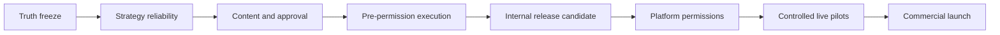

# NEXUS AI — Roadmap to 100% Product Readiness

**تاريخ الخطة:** 22 يوليو 2026  
**المصدر:** [Deep New-User Journey & Product Truth Audit](../audits/2026-07-22-deep-new-user-journey-audit.md)  
**هدف الخطة:** نقل NEXUS من Marketing OS واعد قبل الإطلاق إلى منتج تسويق متكامل، موثوق، قابل للبيع والتشغيل والقياس.  
**قاعدة التنفيذ:** لا نطلب تصاريح المنصات ولا نفعل Stripe Live قبل اجتياز بوابة الجاهزية الداخلية كاملة.

---

## 1) ماذا تعني “100%”؟

لا تعني “صفر أخطاء إلى الأبد” أو “AI لا يفشل أبدًا”. هذا وعد غير واقعي. تعني أن المنتج يحقق المعايير التالية قبل وصفه بأنه جاهز:

1. **كل وعد ظاهر للمستخدم له مسار عامل ومثبت.**
2. **Organic وPaid وFull تسلّم العقود العددية والنوعية المعلنة.**
3. **لا توجد Blockers أو Critical أو High findings مفتوحة في الرحلة الأساسية.**
4. **لا توجد هلوسة معروفة في regression suite، ولا false positive معروف يمنع المسار.**
5. **كل فشل provider له retry محدود، رسالة مفهومة، refund صحيح، وسجل تشغيلي.**
6. **كل حالة Publish/Spend/Analytics مستندة إلى دليل provider، لا inference.**
7. **كل سعر وحد واستهلاك ووعد قانوني متسق بين الصفحة والكود والفاتورة.**
8. **المسارات الأساسية تعمل بالعربية والإنجليزية وعلى Desktop وMobile.**
9. **الأمان، الأداء، الوصول، المراقبة، والاسترداد اجتازت بواباتها.**
10. **بعد التصاريح: حملة Pilot واحدة على الأقل تغلق الحلقة من الاستراتيجية إلى learning موثق.**

### Release gates الرقمية

| المعيار | حد القبول |
|---|---:|
| P0 / Blocker / Critical مفتوحة | 0 |
| High مفتوحة في core journey | 0 |
| مطابقة عدد المخرجات للعقد | 100% في test matrix |
| المنصات خارج scope المستخدم | 0 |
| first-attempt strategy success | ≥95% في live eval set |
| success بعد auto-retry واحد | ≥99% |
| refund الصحيح عند non-delivery | 100% |
| false-positive blockers في regression set | 0 |
| unsupported factual claims في approved output set | 0 |
| Core E2E journeys passing | 100% |
| Critical/High production vulnerabilities | 0، أو استثناء أمني موثق ومحدود المدة |
| Core accessibility | WCAG 2.2 AA على المسارات الأساسية |
| Mobile p75 LCP / INP / CLS | ≤2.5s / ≤200ms / ≤0.1 |
| Provider-confirmed Pilot | 1 Organic + 1 Paid paused-draft، ثم live activation وفق التصريح |
| Closed learning loop | Publish → Analytics → Approved Learning في نفس الحملة |

---

## 2) ترتيب التنفيذ الإجباري

لا نبدأ مرحلة لاحقة لمجرد اكتمال الكود. الانتقال يحدث فقط بعد اجتياز **Exit Gate** المرحلة.

---

## 3) المرحلة 0 — Truth Freeze وتثبيت نطاق المنتج

**المدة:** 1–2 يوم عمل  
**الأولوية:** P0  
**الهدف:** منع زيادة التناقض أثناء الإصلاح.

### العمل

- تحويل تقرير الأوديت إلى issue registry واحدة بالـIDs الموجودة: B/C/H/M.
- تجميد إضافة features جديدة حتى إغلاق P0/P1.
- تعريف product vocabulary واحد:
  - Strategy
  - Content Plan
  - Draft
  - Approved
  - Scheduled
  - Provider Published
  - Eligible Analytics
  - Applied Learning
- تحديد claim مؤقت صادق للمنتج أثناء التطوير: “Pre-launch Marketing OS”.
- Feature-flag أو توضيح Paid/Full إذا كانا لا يزالان غير موثوقين، بدل ترك وعد عامل ظاهريًا.
- تحديد source of truth لكل حالة وعدد وحد وتكلفة في الكود.
- تثبيت Test Brand Pack يشمل Luma Roast Lab كـregression fixture.

### التسليمات

- Issue registry مصنفة P0/P1/P2.
- Product truth glossary.
- Promise inventory: كل claim عامة ومكان إثباتها.
- Release checklist موحدة.

### Exit Gate 0

- لا feature جديدة خارج الإصلاحات.
- كل finding في الأوديت مرتبط بمالك واختبار قبول.
- لا يوجد claim في public copy بلا owner وproof path.

---

## 4) المرحلة 1 — إصلاح قلب المنتج: Strategy Reliability

**المدة:** 8–10 أيام عمل  
**الأولوية:** P0  
**الهدف:** Organic وPaid وFull تنتج مخرجات قابلة للحفظ والمراجعة بثبات.

### 1.1 Sentinel والـtruth gates

- إصلاح Arabic negation بشكل لغوي، بما يشمل:
  - عدم استخدام
  - لا تستخدم
  - يجب عدم
  - ممنوع استخدام
  - تجنب/تجنّب
  - دون ادعاء
- فصل الحقول إلى:
  - customer-facing claims
  - internal safety instructions
  - assumptions
  - proof tasks
- عدم فحص `doNotDoYet` أو compliance instruction كأنها copy موجهة للعميل.
- تحويل كلمات مثل “premium/فاخر” من hard blocker إلى أحد الآتي حسب السياق:
  - verified claim
  - style descriptor
  - warning قابل للتعديل
  - blocker فقط إذا كانت superiority claim موجهة للعميل بلا دليل
- إضافة semantic claim checks لمشكلات لا يلتقطها regex:
  - recently → immediately
  - invented testimonials/customer stories
  - invented workplace/use case
  - invented audience pain
  - invented market-share objective
- منع CTA التشغيلية من الظهور كـconsumer CTA.
- جعل كل finding يحمل:
  - exact path
  - exact quoted text
  - سبب الحجب
  - suggested safe rewrite
  - مصدر الحقيقة الذي ينقصه
- إضافة human resolution موثقة:
  - Edit exact text
  - Attach proof
  - Mark as hypothesis
  - Re-run only affected checks
  - Override استثنائي مع reason + audit log، لا bypass صامت

### 1.2 Paid Strategy

- حفظ raw provider output في diagnostic envelope آمنة، دون عرضه مباشرة للمستخدم.
- تحديد أي جزء من العقد يفشل: audiences/angles/copies/briefs، بدل رسالة عامة.
- تطبيق deterministic repair لكل عنصر مخالف قبل رفض الحزمة كاملة.
- عدم اعتبار style descriptors commercial claim تلقائيًا.
- ضمان exact counts:
  - 3 audiences
  - 4 angles
  - 9 ad copies
  - 4 creative briefs
- كل copy مرتبطة بـaudience + angle + platform + CTA + proof status.
- إن فشل عنصر واحد بعد repair، يُعاد توليد العنصر وحده لا الحزمة كلها.
- حفظ structured failed run بسعر 0 إذا لم يحدث delivery.

### 1.3 Full Strategy

- فصل Organic وPaid كخطوتين transactionally مستقلتين داخل full workflow.
- عدم خسارة Organic output إذا فشل Paid.
- إظهار partial state بوضوح، مع retry للجزء الفاشل فقط.
- منع الخصم النهائي الكامل قبل تحقق deliverables contract.
- اعتماد idempotency key واحد لكل Full run ومفاتيح فرعية لكل جزء.

### 1.4 Organic Strategy

- توحيد count contract بين:
  - `contentAnglesDetailed`
  - weekly execution plan
  - platform distribution
  - campaign scope
  - plan cap
- frequency يجب أن تعكس العدد الشهري الفعلي، لا إيقاعًا أكبر منه.
- منع funnel من الانحصار في منصة واحدة إذا كانت الحملة تراجع ثلاث منصات، إلا إذا كان ذلك قرارًا معللًا.
- تمييز asset requirement عن asset موجود.
- أسماء الحملات تتضمن scope/count أو run label واضحًا.

### 1.5 Reliability UX

- progress stages حقيقية أثناء الانتظار.
- timeout واضح بدل spinner مفتوح.
- auto-retry واحد فقط للأخطاء القابلة لإعادة المحاولة.
- رسالة فشل user-facing دون raw internal code.
- “Retry failed section” بدل إعادة بناء الحزمة ودفع التكلفة كاملة.
- تحديث balance فورًا بعد settlement/refund.

### Test Matrix 1

#### Deterministic fixtures — بلا provider cost

- 6 verticals: ecommerce، local service، SaaS، healthcare-safe، education، hospitality.
- Arabic / English / bilingual.
- proof present / proof absent.
- destination present / absent.
- 1 / 3 / 10 / 16 / 25 / 30 post contracts.
- negated risky claims بكل الصيغ العربية والإنجليزية.
- exact paid package counts.

#### Live provider evals

- 12 Organic runs.
- 12 Paid runs.
- 12 Full runs.
- تشمل Luma Roast Lab بلا testimonials ولا discounts ولا result guarantees.
- لا تستخدم أرصدة مستخدم؛ تسجل ضمن QA/provider-cost ledger منفصل.

### Exit Gate 1

- Organic/Paid/Full تحقق العقود العددية 100% في fixtures.
- ≥95% first-attempt و≥99% بعد retry في live evals.
- صفر false-positive blocker في negation suite.
- صفر testimonial أو performance claim بلا proof في approved eval outputs.
- كل فشل له zero-charge أو refund صحيح وسجل مفهوم.

**ممنوع بدء Content/Publishing work قبل اجتياز هذه البوابة.**

---

## 5) المرحلة 2 — Content Production & Approval Golden Path

**المدة:** 6–8 أيام عمل  
**الأولوية:** P0  
**الهدف:** تحويل استراتيجية معتمدة إلى منشورات حقيقية قابلة للمراجعة دون تناقض حالات.

### العمل

- state machine واحدة:
  - Strategy Ready
  - Strategy Approved
  - Content Generating
  - Copy Draft
  - Copy Approved
  - Media Missing/Ready
  - Media Approved
  - Schedule Ready
- Content Plan يستهلك العدد المحفوظ نفسه، لا يعيد تخمين scope.
- كل post يحتوي:
  - platform
  - funnel stage
  - objective
  - hook
  - caption/body
  - CTA
  - asset requirement
  - proof references
  - claim status
- platform-native validation:
  - طول النص
  - media requirement
  - supported format
  - hashtags/links where relevant
- لا تُحتسب فكرة أو placeholder كمنشور مكتمل.
- تحرير موضعي وإعادة فحص للمنشور فقط.
- approval immutable snapshot للنص والوسائط.
- تعديل بعد الموافقة يعيد الحالة إلى Needs Approval.
- Content Hub يعرض السبب الدقيق للحجب، لا زرين متكررين يؤديان لنفس المكان.
- asset request ينتقل إلى Media Library/Creative Brief مع status واضح.
- اختبار upload حقيقي: image + video + invalid type + oversize + interrupted upload.

### Exit Gate 2

- Organic 3-post و10-post و16-post تصل إلى approved content plan.
- Full strategy تصل إلى organic drafts وpaid package من نفس campaign.
- 100% من post counts تطابق العقد.
- 100% من approved posts لها immutable approval evidence.
- 0 placeholders و0 unsupported claims في approved set.
- upload/retry/delete/attach تعمل داخل workspace isolation.

---

## 6) المرحلة 3 — Execution قبل التصاريح

**المدة:** 5–7 أيام عمل  
**الأولوية:** P0/P1  
**الهدف:** إثبات كل منطق التنفيذ محليًا من دون لمس منصة حقيقية.

### العمل

- إنشاء provider adapter contract موحد:
  - validate
  - createPausedDraft
  - publish
  - readStatus
  - fetchAnalytics
  - pause
  - retry
- Fake/Test provider adapter في staging فقط.
- اختبار idempotency: نفس command لا ينشئ post/ad مرتين.
- اختبار queue claim/reclaim بعد worker crash.
- اختبار schedule timezone وDST والوقت الماضي.
- اختبار disconnect بعد approval وقبل publish.
- اختبار media rejection من provider.
- اختبار retryable 429/5xx مقابل permanent 4xx.
- Paid execution ينشئ paused draft فقط في mock path.
- activation/spend يتطلب confirmation مستقلًا ولا يعمل في mock بلا evidence.
- إصلاح Google Ads `redirect_uri` وتوحيد canonical domain.
- reset OAuth loading state بعد cancel/back/error.
- التأكد أن كل provider غير configured يظهر disabled reason بدل OAuth broken.

### Exit Gate 3

- 100% من provider contract tests تمر.
- 0 duplicate publishes في idempotency tests.
- schedule/publish failure recovery مثبتة.
- paused ad draft لا يتحول إلى active بلا confirmation record.
- كل callback URL يطابق canonical production URL.
- لا platform permission مطلوبة لإكمال الاختبارات الداخلية.

---

## 7) المرحلة 4 — Conversion, CRM, Attribution & Learning Hardening

**المدة:** 4–5 أيام عمل  
**الأولوية:** P1  
**الهدف:** تثبيت أقوى جزء حالي بدل توسيعه بميزات جديدة.

### العمل

- regression tests لرحلة:
  - landing visit
  - CTA click
  - form submit
  - recapture/deduplication
  - lead stages
  - WON + revenue
  - first-touch attribution
- فصل الأرقام بوضوح:
  - submissions
  - unique leads
  - qualified leads
  - won deals
  - revenue
- sample-size badge واضح في Analytics.
- عدم وصف 1/1 أو 2/2 بأنه “performance proven”.
- Learning proposal لا تُنشأ قبل threshold موثق.
- campaign-scoped attribution يربط landing/form/lead/WON بالحملة الصحيحة.
- UTM builder وcopy feedback واختبار malformed params.
- lifecycle remains drafts-only حتى تفعيل provider وإثبات unsubscribe/suppression.

### Exit Gate 4

- رحلة direct وUTM تمر E2E في CI/staging.
- deduplication لا تضيع recapture history.
- first-touch وlast-touch يعرضان تعريفهما ولا يختلطان.
- causalClaim=false تحت threshold دائمًا.
- revenue لا يُحسب من form submit دون WON evidence.

---

## 8) المرحلة 5 — Commercial, Legal, Security & Product Truth

**المدة:** 5–7 أيام عمل، ويمكن تنفيذها بالتوازي بعد استقرار Phase 1  
**الأولوية:** P0 قبل real money  
**الهدف:** جعل الوعد والسعر والقانون والأمان متطابقين مع المنتج.

### Pricing/Billing

- تصحيح Trial: يوضح أنه Organic Light logic بحد 3 outputs، لا 8–10.
- تصحيح Autopilot capacity: لا يعد بثلاث Full workflows إذا كانت 48 drafts تتجاوز حد 40.
- بناء calculator واحد يحترم credits + campaign limit + planned-post limit معًا.
- تسمية credit ledger حسب العملية الحقيقية.
- إضافة zero-charge failed attempts إلى operational history، لا credit ledger المالي إن لم يحدث خصم.
- Stripe Live يظل disabled.

### Legal

- حذف “GDPR/CCPA Compliant” المطلق أو توثيق أساس قانوني حقيقي ومراجعة مختص.
- نشر:
  - contracting entity
  - registered address
  - jurisdiction
  - governing law
  - tax/payment identity
- توحيد last-updated dates.
- مطابقة service-provider list مع الاستخدام الفعلي.
- مراجعة deletion/export/retention procedure عمليًا.
- لا real-money launch قبل اكتمال هذه البنود.

### Security

- معالجة `fast-uri` و`sharp` وNext transitive advisory.
- تشغيل dependency scanning في CI.
- مراجعة upload MIME/content validation وsigned upload expiry.
- التحقق من workspace isolation على حملات/وسائط/leads/exports.
- مراجعة admin routes وrole enforcement.
- اختبار OAuth state/nonce replay وtoken encryption rotation.
- test للـcron auth وwebhook signatures.
- secrets inventory بلا طباعة القيم.

### Product Truth

- ReferralWidget يظهر في Settings/Billing أو يزال FAQ حتى يصبح قابلًا للاستخدام.
- public site claim matrix ترتبط بحالة features المثبتة.
- المساعد يقرأ:
  - first-party analytics
  - current campaign blockers
  - actual connections
  - available landing/CRM features
- إزالة legacy naming من user-facing copy.

### Exit Gate 5

- 0 Critical/High vulnerabilities غير معالجة.
- pricing examples تمر calculator tests.
- كل public promise مرتبط بـpassed E2E test.
- legal identity مكتملة قبل Stripe Live.
- assistant لا يدعي غياب first-party data الموجود ولا وجود platform data المفقود.

---

## 9) المرحلة 6 — UX, Visual, Accessibility & Performance Finish

**المدة:** 5–6 أيام عمل  
**الأولوية:** P1  
**الهدف:** جعل التجربة فاخرة وسهلة من دون إضافة features.

### UX consistency

- Readiness dictionary واحد عبر onboarding/Brand/Strategy/Dashboard/Operations.
- إزالة “أول استراتيجية” بعد أول campaign.
- campaign cards تعرض:
  - type
  - scope/count
  - language
  - current blocker
  - created time/run label
- Operations:
  - “Campaigns in review” بدل “in motion” عند الحجب
  - links لها anchors أو destinations حقيقية
  - filters توضح أنها تخص decision queue فقط
- توحيد `/automation` و`/operations` و`/publish` داخل information architecture.
- إخفاء/flag A/B experiment حتى يصبح operationally ready.

### Visual/Mobile

- cookie banner compact/collapsible ولا يحجب CTA.
- إصلاح mobile sidebar footer overlap.
- فحص كل breakpoint: 320/375/390/768/1024/1440.
- توحيد typography، card density، spacing، status colors.
- Arabic RTL وEnglish LTR visual regression.

### Accessibility

- accessible names لكل icon/overflow/assistant buttons.
- keyboard traversal لكل modal/menu/tab/form.
- visible focus.
- headings/landmarks hierarchy.
- contrast وerror association.
- calendar empty cells ليست buttons بلا action.

### Performance

- تقسيم campaign detail الضخم حسب tab.
- lazy-load Studio/Creative/Charts/Assistant.
- تقليل First Load للصفحات الأساسية.
- budgets في CI.
- اختبار slow 4G وmid-range mobile.

### Exit Gate 6

- 0 serious/critical accessibility findings في core journeys.
- visual regression يمر بالعربية والإنجليزية.
- p75 budgets مستوفاة في staging/production-like run.
- لا CTA أو nav item محجوب على المقاسات المحددة.

---

## 10) المرحلة 7 — Internal Release Candidate

**المدة:** 4–5 أيام عمل  
**الأولوية:** بوابة قبل التصاريح  
**الهدف:** إثبات أن المنتج الداخلي كامل قبل الاعتماد على أي منصة.

### الرحلات الإلزامية

1. New user → onboarding → Brand Brain.
2. Organic Exact 3 → Sentinel → Content → Approval → Mock Schedule → Mock Publish evidence.
3. Organic Light 10 → نفس الرحلة.
4. Paid → exact package → approved → paused mock platform draft.
5. Full → organic + paid → partial retry test → complete.
6. Landing → Form → Lead → WON → Attribution → Learning threshold behavior.
7. Failure scenarios: provider timeout، 429، malformed output، credit refund، duplicate command.
8. Arabic/English + Desktop/Mobile.

### Required artifacts

- E2E video/screenshot evidence.
- automated test report.
- strategy eval report.
- credit reconciliation report.
- security report.
- accessibility report.
- performance report.
- promise-to-proof matrix.

### Exit Gate 7 — الإذن بطلب تصاريح المنصات

- كل Release Gate الداخلي أخضر.
- P0/P1 = صفر.
- 36 live strategy evals تحقق thresholds.
- core E2E = 100%.
- internal readiness = 5/5.
- لا real payment ولا platform publish تم بعد.

**فقط بعد هذه البوابة نبدأ التصاريح.**

---

## 11) المرحلة 8 — Platform Permissions & Controlled Connections

**المدة الداخلية:** 3–5 أيام إعداد  
**المدة الخارجية:** متغيرة؛ غالبًا 2–8+ أسابيع حسب كل منصة  
**الأولوية:** بعد Gate 7 فقط

### ترتيب الطلبات

1. Meta organic publishing/readback.
2. LinkedIn organization publishing/readback.
3. TikTok publishing/readback.
4. YouTube upload/readback.
5. Google Ads.
6. Meta Ads.
7. بقية المنصات حسب الطلب التجاري الفعلي، لا دفعة واحدة.

### لكل منصة

- scopes minimum necessary.
- privacy/data deletion URLs صحيحة.
- app review video يطابق المنتج الحقيقي.
- callback canonical واحد.
- reconnect/disconnect/token refresh tested.
- permission downgrade behavior tested.
- no publish on connect.
- test/sandbox account أولًا.
- audit evidence لكل API action.

### Exit Gate 8

- provider connection confirmed.
- scopes verified من provider response.
- reconnect/token refresh يعملان.
- disconnect يزيل/يبطل tokens safely.
- لا claim “connected” من مجرد OAuth redirect.

---

## 12) المرحلة 9 — Live Pilot وإغلاق الحلقة

**المدة:** 7–10 أيام عمل بعد أول تصاريح  
**الأولوية:** P0 قبل commercial launch

### Pilot A — Organic

- Campaign واحدة محدودة.
- 3 منشورات فقط.
- اعتماد copy وmedia لكل منشور.
- نشر واحد يدوي explicit، ثم scheduled API publish.
- حفظ provider post IDs.
- analytics readback بعد threshold.
- learning proposal تعرض evidence والعينة.
- المستخدم يعتمد proposal.
- Brand Brain learning يسجل rollback.

### Pilot B — Paid

- approved Paid strategy.
- منصة واحدة وحساب اختبار/ميزانية شديدة الانخفاض بعد موافقة صريحة.
- create paused campaign/ad set/ad.
- verify payload.
- activation confirmation منفصل.
- spend cap وkill switch.
- readback للحالة والإنفاق.
- pause/reconcile.

### Exit Gate 9

- Organic: provider-confirmed publish + analytics + applied learning في نفس الحملة.
- Paid: paused draft مثبت؛ وإذا سمح الاختبار، activation/spend/pause بأدلة صحيحة.
- لا duplicate objects.
- spend لا يتجاوز approved cap.
- كل provider failure يظهر في Operations ويملك recovery.

---

## 13) المرحلة 10 — Commercial Launch

**المدة:** 3–5 أيام عمل بعد Pilot  
**الأولوية:** آخر خطوة

### العمل

- legal launch approval.
- Stripe Live price IDs/webhooks/portal/refunds.
- production env audit.
- domain/email authentication.
- backups and restore drill.
- incident response + on-call ownership.
- support SLA وhelp content.
- status page/operational communication.
- staged rollout:
  - internal
  - 5 design partners
  - 25 users
  - broader GA
- rollback flags لكل provider path.

### Exit Gate 10 — “100% Ready”

- كل gates السابقة موثقة.
- 0 P0/P1.
- real billing/legal جاهزان.
- 7 أيام pilot دون data-loss أو unauthorized action.
- credit/provider reconciliation = 100%.
- support/incident process عامل.
- marketing site يعرض فقط capabilities المثبتة.

---

## 14) ما لن نضيفه قبل الوصول إلى 100%

لمنع feature creep:

- لا AI video generation واسع.
- لا منصات جديدة قبل نجاح أول منصتين.
- لا social listening واسع.
- لا community inbox كامل.
- لا SEO suite.
- لا complex multi-touch attribution جديد.
- لا advanced A/B engine.
- لا enterprise RBAC موسع قبل ثبات approval الأساسية.
- لا microservices/Kubernetes/queue architecture أكبر من الحاجة الحالية.

هذه ليست احتياجات لإغلاق الأعطال الحالية، وتُعاد دراستها بعد GA وفق استخدام العملاء.

---

## 15) التقدير الزمني الواقعي

| المجموعة | أيام العمل المقدرة |
|---|---:|
| Phase 0 — Truth freeze | 2 |
| Phase 1 — Strategy reliability | 10 |
| Phase 2 — Content & approvals | 8 |
| Phase 3 — Pre-permission execution | 7 |
| Phase 4 — Conversion hardening | 5 |
| Phase 5 — Legal/security/truth | 7، جزء منها متوازٍ |
| Phase 6 — UX/accessibility/performance | 6 |
| Phase 7 — Internal RC | 5 |
| Phase 8 — Permission preparation | 5 + انتظار خارجي |
| Phase 9 — Live pilots | 10 |
| Phase 10 — Commercial launch | 5 |

### المدة الإجمالية

- **الاكتمال الداخلي قبل التصاريح:** 7–10 أسابيع عمل مركّز.
- **التصاريح:** 2–8+ أسابيع خارج سيطرتنا، ويمكن تداخلها بعد Internal RC.
- **Pilot والإطلاق التجاري:** 2–3 أسابيع بعد أول التصاريح.
- **الإجمالي الواقعي:** 11–20 أسبوعًا حسب سرعة مراجعات المنصات والكيان القانوني.

هذا تقدير لتيار تنفيذ أساسي واحد مدعوم بأتمتة واختبارات، وليس موعدًا مضمونًا.

---

## 16) ترتيب الـBacklog لأول Sprintين

### Sprint 1 — لا شيء أهم منه

1. Reproduce Paid failure باختبار ثابت.
2. إصلاح Arabic negation false positive.
3. فصل customer-facing copy عن safety instructions.
4. إصلاح quality superlative classification.
5. إصلاح Paid exact package generation/repair.
6. حفظ failed-run diagnostics بلا خصم.
7. اختبارات Luma Organic/Paid/Full.
8. تصحيح public availability مؤقتًا إذا لم تجتز المسارات.

### Sprint 2

1. Full partial persistence + targeted retry.
2. Organic count/frequency/platform consistency.
3. Content Plan golden path.
4. Approval immutable snapshots.
5. exact post/asset readiness states.
6. Credit/retry/refund E2E.
7. campaign naming/blocker visibility.
8. Internal RC journey الأولى حتى mock publish.

---

## 17) لوحة متابعة أسبوعية

لا نقيس التقدم بعدد الملفات أو الصفحات، بل بهذه الأرقام:

| KPI | البداية من الأوديت | الهدف |
|---|---:|---:|
| Strategy types working | 1 جزئيًا من 3 | 3/3 |
| Organic campaigns reaching Content | 0/3 | 100% للعينات المؤهلة |
| Paid successful audited runs | 0/2 | ≥95% first attempt |
| Full successful audited runs | 0/1 | ≥95% first attempt |
| Known false-positive blockers | 2+ | 0 |
| Known missed unsupported claims | 5+ | 0 في regression set |
| Internal readiness boundaries | 3/5 في آخر فحص | 5/5 |
| Provider-confirmed publishes | 0 | ≥1 Pilot |
| Closed-loop campaigns | 0 | ≥1 Pilot |
| High dependency vulnerabilities | 3 | 0 |
| P0/P1 findings | متعددة | 0 قبل launch |

---

## 18) القرار التنفيذي

المسار الصحيح ليس طلب التصاريح الآن ثم العودة لإصلاح المنتج. الترتيب الصحيح:

1. تثبيت الحقيقة والوعود.
2. إصلاح Strategy OS حتى تعمل الأنواع الثلاثة بثبات.
3. إثبات Content وApproval وMock Execution كاملًا.
4. إغلاق pricing/legal/security/UX gaps.
5. اجتياز Internal Release Candidate.
6. طلب التصاريح.
7. تنفيذ Pilot صغيرة موثقة.
8. تفعيل Stripe Live والإطلاق التجاري في النهاية.

عند تطبيق هذه الخطة واجتياز بواباتها، يمكن وصف NEXUS بصدق بأنه **AI Marketing Operating Company/Product** متكامل ضمن نطاقه المعلن—وليس مجرد مولد محتوى أو واجهة جميلة.
